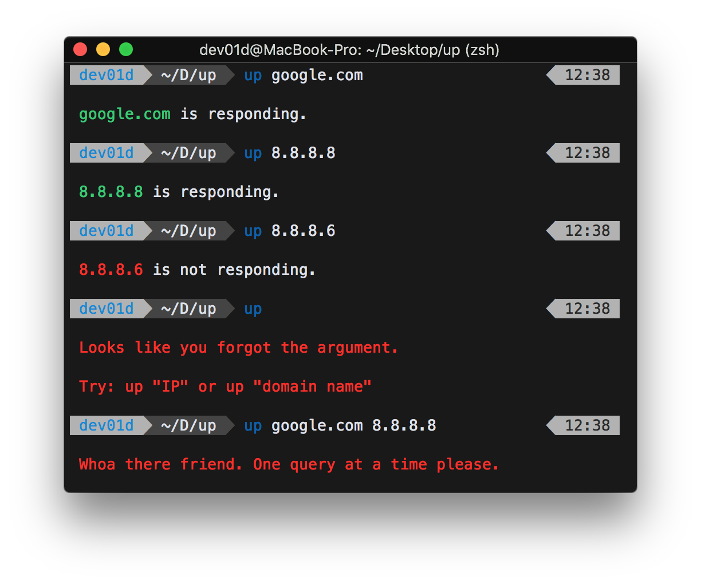

<h1 align="center">
  
</h1>

## What _is_ Up?

Up is a CLI program written in JavaScript to simply check if a server or domain responds to ICMP packets

### Up utilizes:

- [Ping](https://www.npmjs.com/package/ping) for, you know, the ping part
- [Chalk](https://www.npmjs.com/package/chalk) for colored output

### Try it

To try from cloned repo, cd into repo and run `$ npm install` then `$ ./index.js google.com`

If you don't have Node installed or just want a cleaner install download a compiled binary from [releases](https://github.com/dev01d/up/releases).

- Binaries are compiled using [pkg from Zeit](https://www.npmjs.com/package/pkg)
- Optional: compile your own specifying your OS with `$ pkg . -t latest-"linux/macos/win"-x64` after you've installed pkg of course

This is an exploratory attempt to rewrite [a bash script](https://github.com/dev01d/shell-tools/blob/master/up) in JS.
